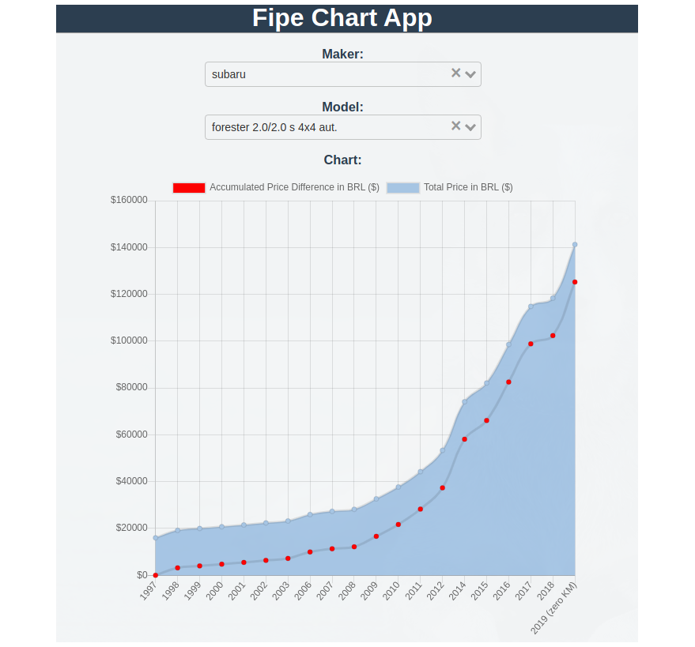

# Fipepy API

This is an API for ["Tabela Fipe"](https://www.fipe.org.br/) to figure out the average price of several car models in Brazil.

## API Docs

[API Schema](./docs/api.json)

## Demo on Google Cloud Platform

### REST API

- To list all makers

GET [http://35.237.184.43:8000/fipe/v1/makers/](http://35.237.184.43:8000/fipe/v1/makers/)

- To list all car models of a maker

GET [http://35.237.184.43:8000/fipe/v1/makers/subaru/cars/](http://35.237.184.43:8000/fipe/v1/makers/subaru/cars/)

### Frontend Chart App

Open in your browser: [http://35.237.184.43:8080](http://35.237.184.43:8080). You should see something similar to this screenshot bellow:

## Disclaimer

There's no guarantee about the accuracy of the price information, this project was built for demo purposes only.
